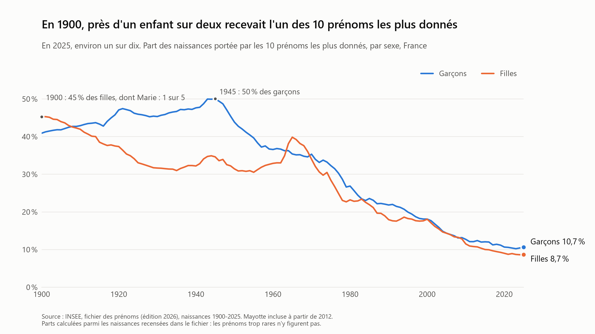
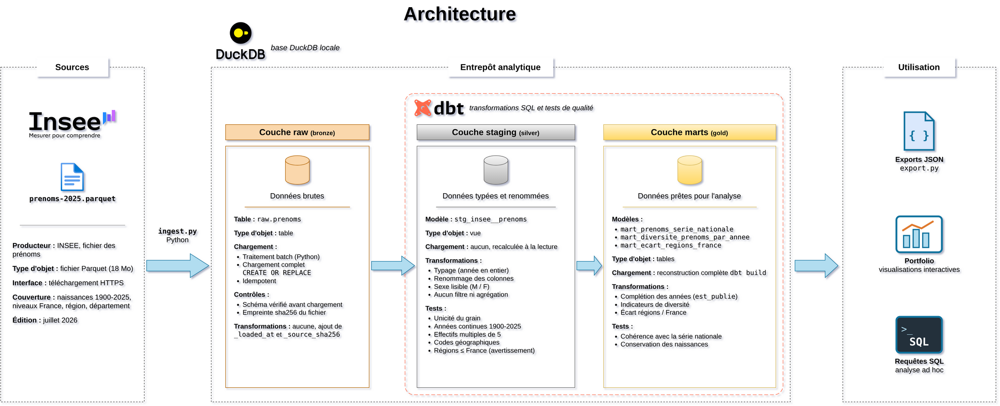
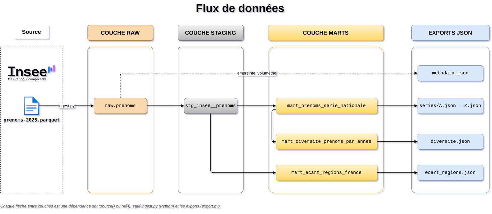

# Prénoms en France, 1900-2025

[](https://github.com/Majin-M/prenoms_france/actions/workflows/pipeline.yml)

Pipeline de données construit à partir du **fichier des prénoms de l'INSEE** (édition juillet 2026) : ingestion en Python, stockage dans DuckDB, transformations et 39 tests de qualité avec dbt, export JSON pour une page de portfolio.



**En 1900, près d'un enfant sur deux recevait l'un des 10 prénoms les plus donnés. En 2025, c'est environ un sur dix.** Marie portait à elle seule 20,6 % des naissances de filles en 1900. Chez les garçons, la concentration culmine en 1945 (50 %), puis les deux courbes se rejoignent et baissent ensemble à partir des années 1970.

## Objectif

Le projet met en pratique :

- une couche `raw` fidèle à la source et traçable ;
- des transformations SQL versionnées, documentées et testées ;
- des limites des données mesurées et écrites;
- un pipeline qui se relance en une commande.

## Démarrage rapide

```powershell
python -m venv .venv
.venv\Scripts\Activate.ps1
pip install -r requirements.txt

.\run.ps1
```

Sous Linux ou macOS, avec PowerShell 7 : `pwsh ./run.ps1`.

`run.ps1` enchaîne les trois étapes et s'arrête à la première en échec (code de sortie 1) :

1. `python ingest.py` télécharge le fichier INSEE s'il n'est pas déjà dans `data/`, vérifie son schéma et remplace la table `raw.prenoms`.
2. `dbt build` crée les modèles `staging` et `marts` et lance les tests. Un test en échec bloque les modèles qui en dépendent.
3. `python export.py` écrit les fichiers JSON dans `exports/`.

Le projet s'arrête à la préparation des données : les graphiques sont dessinés par le portfolio, qui lit ces fichiers JSON (copiés dans son dossier `public/data/prenoms/`). Les données ne changent qu'une fois par an, à chaque édition de l'INSEE.

Chaque script Python chronomètre ses étapes dans le terminal et dans `logs/`. Le pipeline complet prend moins de deux minutes, hors téléchargement.

## Architecture



### Flux de données



Les sources des deux schémas sont dans `docs/` (fichiers draw.io).

| Couche | Rôle | Objets |
|---|---|---|
| `raw` | Copie fidèle du fichier source, avec la date de chargement et l'empreinte sha256 du fichier | `raw.prenoms` (table, `ingest.py`) |
| `staging` | Nettoyage et typage, sans logique métier | `stg_insee__prenoms` (vue dbt) |
| `marts` | Tables prêtes pour l'analyse et l'export | `mart_prenoms_serie_nationale`, `mart_diversite_prenoms_par_annee`, `mart_ecart_regions_france` (tables dbt) |
| export | Fichiers JSON pour le portfolio, lignes publiées uniquement | `exports/series/<INITIALE>.json`, `diversite.json`, `ecart_regions.json`, `metadata.json` |

| Mart | Grain | Contenu |
|---|---|---|
| `mart_prenoms_serie_nationale` | prénom, sexe, année | Naissances de 1900 à 2025, complétées par 0 ; `est_publie` ; part des naissances |
| `mart_diversite_prenoms_par_annee` | année, sexe | Nombre de prénoms, part du top 10, prénoms couvrant la moitié des naissances, nombre effectif (inverse de l'indice de Simpson) |
| `mart_ecart_regions_france` | année | Part des naissances du total France absentes de la somme des régions |

Le détail de chaque colonne, avec son type et un exemple, est dans le [catalogue de données](docs/catalogue_de_donnees.md).

## Décisions techniques

| Décision | Pourquoi |
|---|---|
| **DuckDB dans un fichier local** | Base analytique en colonnes, sans serveur à installer. Elle lit le Parquet directement et traite les 6,6 millions de lignes en quelques secondes. |
| **`raw` est une copie fidèle, avec `_loaded_at` et `_source_sha256`** | On sait toujours quelle version du fichier a été chargée et quand. Tout nettoyage se fait dans dbt, où il est versionné et testé. |
| **Staging en vue, marts en tables** | Le staging ne fait que renommer et typer : une vue suffit et ne stocke rien. Le mart de la série nationale (6,6 millions de lignes, fonctions de fenêtre) est matérialisé pour ne pas être recalculé à chaque lecture. |
| **Années absentes complétées par 0, avec une colonne `est_publie`** | Un 0 ajouté par le pipeline ne veut pas dire la même chose qu'un 0 observé : il signifie « absent du fichier », c'est-à-dire aucune naissance ou trop peu pour être publiées. La différence est gardée dans la table, pas seulement dans la documentation. |
| **L'export n'envoie que les lignes publiées, découpées par initiale** | 89 % des lignes du mart sont des zéros complétés. L'export ne garde que les 724 645 lignes publiées, réparties en 26 fichiers (7,9 Mo au total), au format `{"STEVEN": {"M": [[1946, 5], ...]}}`. Le site ne charge que l'initiale tapée (sans accent : ÉLODIE est dans `E.json`) et complète lui-même les zéros. |
| **Le projet s'arrête aux fichiers JSON** | Les graphiques sont codés à un seul endroit, le portfolio, avec la même identité visuelle partout. |
| **Parts calculées sur les naissances recensées dans le fichier** | C'est le seul dénominateur disponible dans la source. Les parts sont donc légèrement surestimées (7,8 % des naissances de 2020 manquent), ce que `metadata.json` rappelle au site. La proportion neutralise l'effet du baby-boom, qui fausse les effectifs bruts. |
| **Un test singulier par constat d'exploration** | Chaque particularité découverte (effectifs multiples de 5, grain unique, années continues, pas de ligne de regroupement, Mayotte à partir de 2012…) devient une vérification automatique, relancée à chaque exécution. |
| **Chaque test singulier a été vu en échec** | Un test mal écrit peut passer à tous les coups. Chaque test singulier a été lancé une fois sur des données volontairement faussées (ligne en double, code géographique invalide, année manquante…) ou avec une règle modifiée (`% 5` remplacé par `% 7`), pour vérifier qu'il détecte bien le défaut. |
| **Avertissement, et non échec, sur l'écart régions / France, au seuil de 15 %** | L'écart mesuré par année et par sexe va de 0,7 % à 11,6 %, toujours dans le même sens, ce qui exclut l'arrondi comme cause. Un seuil à 1 % aurait déclenché 226 avertissements sur 252, et un avertissement permanent n'est plus lu. |
| **Variable dbt `derniere_annee`** | Une nouvelle édition de l'INSEE demande de changer une seule ligne. La variable permet aussi de détecter une édition incomplète, à qui il manquerait la dernière année. |
| **Conventions de nommage écrites et appliquées** | Voir [docs/conventions_de_nommage.md](docs/conventions_de_nommage.md) : `stg_<source>__<entité>`, `mart_<sujet>`, préfixe `nombre_` pour les comptages, colonnes techniques préfixées par `_`. |

## Qualité des données

39 tests dbt, lancés à chaque `dbt build` :

- **28 tests génériques** : `not_null`, `unique` et `accepted_values`, sur les colonnes de chaque modèle.
- **10 tests singuliers bloquants** : grain unique, effectifs multiples de 5, années continues depuis 1900, couverture de chaque zone (Mayotte à partir de 2012), cohérence des codes géographiques avec leur niveau, absence de ligne de regroupement des prénoms rares, série nationale complète, conservation des naissances entre staging et mart, somme des parts égale à 1, cohérence des indicateurs de diversité.
- **1 avertissement** : écart entre la somme des régions et le total France.

Les constats qui justifient chaque test sont détaillés dans [NOTES.md](NOTES.md).

### Intégration continue

À chaque push et pull request sur `main`, GitHub Actions ([pipeline.yml](.github/workflows/pipeline.yml)) relance tout le pipeline sur une machine Linux, avec le vrai fichier INSEE : ingestion, `dbt build` avec les 39 tests, puis export. Un test en échec fait échouer le workflow. Les fichiers JSON produits sont téléchargeables dans l'onglet Actions (artefact `exports`), et les journaux restent disponibles même en cas d'échec.

Les versions de Python et des dépendances sont figées (`requirements.txt`), pour que le résultat ne change pas d'une exécution à l'autre sans modification du code. Le résumé de la dernière exécution (modèles, durées, tests par statut) est recopié dans `exports/metadata.json`, pour que le portfolio puisse l'afficher.

## Limites des données

Constats de l'exploration (détails dans [NOTES.md](NOTES.md)), dont il faut tenir compte dans toute analyse :

- **Toutes les naissances ne sont pas dans le fichier.** Pour 2020, le fichier compte 677 665 naissances en France, contre 735 186 selon l'INSEE : 7,8 % des naissances manquent. Les prénoms trop rares ne sont pas diffusés, et aucune ligne ne les regroupe. Une somme de naissances n'est donc pas un nombre total de naissances.
- **Les niveaux géographiques ne s'additionnent pas.** La somme des régions est toujours inférieure au total France, et l'écart grandit avec le temps : environ 1 % dans les années 1900, jusqu'à 11,6 % pour les filles en 2024 (10,3 % tous sexes confondus). Cause probable : un prénom assez fréquent pour être publié au niveau national peut être trop rare dans chaque région pour y figurer. Pour un total national, il faut utiliser le niveau `FRANCE`, jamais une somme de régions ou de départements.
- **Les effectifs sont arrondis à 5.** Toutes les valeurs sont des multiples de 5, la plus petite vaut 5. Les petits effectifs sont donc approximatifs : un 5 ne veut pas dire exactement 5 naissances.
- **Une année sans naissance n'a pas de ligne.** Il n'y a pas de ligne à zéro : LIAM, par exemple, n'apparaît que sur 41 des 126 années. Le mart de la série nationale complète ces années par 0.
- **Une zone s'identifie par deux colonnes.** Le code `11` désigne l'Île-de-France au niveau région, mais l'Aude au niveau département. Il faut toujours joindre sur le niveau et le code ensemble (`niveau_geo` + `geo_code` dans le staging).
- **Mayotte n'est couverte qu'à partir de 2012.** Avant 2012, le fichier porte sur la France hors Mayotte : le périmètre change donc en cours de série. L'effet sur les totaux est faible (0,4 % à 0,7 % des naissances), mais plus visible sur le nombre de prénoms distincts, car Mayotte apporte des prénoms rares ailleurs en France (environ 2 % des prénoms publiés chaque année). Pour Mayotte, une année avant 2012 n'est pas une année sans naissance : elle n'est pas couverte.
- **Avant 1946, l'exhaustivité n'est pas garantie** d'après l'INSEE. Les comparaisons entre avant et après 1946 sont donc à prendre avec prudence.
- **Les indicateurs de diversité sous-estiment la diversité réelle**, puisque les prénoms les plus rares ne sont pas comptés.

## Données source

| | |
|---|---|
| Producteur | INSEE, fichier des prénoms |
| Format | Parquet, un seul fichier |
| Période couverte | Naissances de 1900 à 2025 |
| Niveaux géographiques | France entière, région, département |
| Volume | 6 622 949 lignes |

Une ligne donne le nombre de naissances pour un prénom, un sexe, une année et une zone géographique.

## Structure du dépôt

```text
prenoms_france/
├── .github/workflows/
│   └── pipeline.yml           # Intégration continue : pipeline complet à chaque push
├── run.ps1                    # Pipeline complet : ingestion, dbt build, export
├── ingest.py                  # Ingestion : INSEE -> raw.prenoms
├── export.py                  # Export : marts -> exports/*.json
├── NOTES.md                   # Constats d'exploration, interprétations et décisions
├── dbt/
│   ├── dbt_project.yml        # Configuration, dont la variable derniere_annee
│   ├── models/staging/        # stg_insee__prenoms : nettoyage et typage
│   ├── models/marts/          # Série nationale, diversité par année, écart régions / France
│   ├── tests/                 # Tests singuliers, un par constat d'exploration
│   └── macros/
├── exploration/
│   └── explore.py             # Requêtes d'exploration du fichier source
├── docs/
│   ├── img/                   # Schémas et illustration du README
│   ├── architecture.drawio    # Source du schéma d'architecture
│   ├── flux_de_donnees.drawio # Source du schéma de flux
│   ├── catalogue_de_donnees.md
│   └── conventions_de_nommage.md
├── data/                      # Fichier source et base DuckDB (non versionnés)
├── exports/                   # Fichiers JSON pour le portfolio (non versionnés)
├── logs/                      # Journaux d'exécution (non versionnés)
├── LICENSE
└── requirements.txt
```

## Stack

- **Python** pour le téléchargement, le chargement et l'export
- **DuckDB** comme base analytique, dans un simple fichier local
- **dbt** pour les transformations SQL et les tests

## Avancement

- [x] Exploration du fichier source
- [x] Ingestion dans la couche `raw`, avec contrôle du schéma, traçabilité et journalisation
- [x] Modèle dbt `staging`
- [x] Marts : série nationale, diversité par année, écart régions / France
- [x] Tests de qualité des données (génériques, singuliers et avertissement)
- [x] Export JSON pour le portfolio (séries, diversité, écart régions / France, métadonnées du pipeline) et pipeline en une commande
- [ ] Page projet du portfolio, dans un autre dépôt, à partir des fichiers JSON
- [x] Intégration continue (GitHub Actions) : pipeline complet sur Linux à chaque push
- [x] Catalogue de données
- [ ] Graphe de dépendances (`dbt docs`) et référentiel des régions et départements (seed)

## Licence

Code sous licence MIT : voir [LICENSE](LICENSE).

## À propos

Je suis Steven Mouthoud, étudiant en data. Je veux devenir data engineer.
