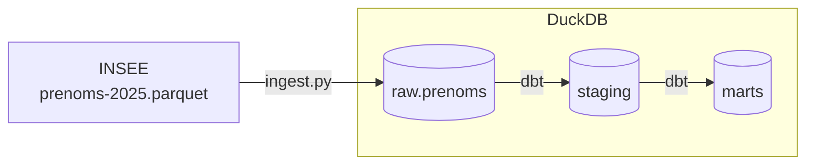

# Prénoms en France, 1900-2025

Pipeline de données construit à partir du **fichier des prénoms de l'INSEE** (édition juillet 2026) : ingestion en Python, stockage dans DuckDB, transformations et tests avec dbt.

L'objectif est de rendre ce fichier facile à interroger, par exemple pour savoir comment la popularité d'un prénom a évolué, par sexe, en France et dans chaque région ou département.

## Données source

| | |
|---|---|
| Producteur | INSEE, fichier des prénoms |
| Format | Parquet, un seul fichier |
| Période couverte | Naissances de 1900 à 2025 |
| Niveaux géographiques | France entière, région, département |
| Volume | 6 622 949 lignes |

Une ligne donne le nombre de naissances pour un prénom, un sexe, une année et une zone géographique.

## Limites des données

Constats de l'exploration (détails dans [NOTES.md](NOTES.md)), dont il faut tenir compte dans toute analyse :

- **Toutes les naissances ne sont pas dans le fichier.** Pour 2020, le fichier compte 677 665 naissances en France, contre 735 186 selon l'INSEE : 7,8 % des naissances manquent. Les prénoms trop rares ne sont pas diffusés, et aucune ligne ne les regroupe. Une somme de `valeur` n'est donc pas un nombre total de naissances.
- **Les niveaux géographiques ne s'additionnent pas.** La somme des régions est toujours inférieure au total France, et l'écart grandit avec le temps : environ 1 % dans les années 1900, jusqu'à 11,6 % en 2024. Cause probable : un prénom assez fréquent pour être publié au niveau national peut être trop rare dans chaque région pour y figurer. Pour un total national, il faut utiliser le niveau `FRANCE`, jamais une somme de régions ou de départements.
- **Les effectifs sont arrondis à 5.** Toutes les valeurs sont des multiples de 5, la plus petite vaut 5. Les petits effectifs sont donc approximatifs : un 5 ne veut pas dire exactement 5 naissances.
- **Une année sans naissance n'a pas de ligne.** Il n'y a pas de ligne à zéro : LIAM, par exemple, n'apparaît que sur 41 des 126 années. Pour tracer une évolution, il faut compléter les années manquantes par 0.
- **Une zone s'identifie par deux colonnes.** Le code `11` désigne l'Île-de-France au niveau région, mais l'Aude au niveau département. Il faut toujours joindre sur `niveau_geographique` et `geographie` ensemble.
- **Avant 1946, l'exhaustivité n'est pas garantie** d'après l'INSEE. Les comparaisons entre avant et après 1946 sont donc à prendre avec prudence.

## Architecture



| Couche | Rôle | Outil |
|---|---|---|
| `raw` | Copie fidèle du fichier source, avec la date de chargement et l'empreinte sha256 du fichier | Python (`ingest.py`) |
| `staging` | Nettoyage et typage : une table par source, sans logique métier | dbt (vue `staging.stg_insee__prenoms`) |
| `marts` | Tables prêtes pour l'analyse | dbt (table `marts.mart_prenoms_serie_nationale`) |

## Stack

- **Python** pour le téléchargement et le chargement
- **DuckDB** comme base analytique, dans un simple fichier local
- **dbt** pour les transformations SQL, les tests et la documentation

## Démarrage rapide

```powershell
python -m venv .venv
.venv\Scripts\Activate.ps1
pip install -r requirements.txt

python ingest.py

cd dbt
dbt build --profiles-dir .
```

Le script télécharge le fichier s'il n'est pas déjà dans `data/`, vérifie son schéma, puis remplace entièrement la table `raw.prenoms` dans `data/prenoms.duckdb`. Chaque étape est chronométrée dans le terminal et dans `logs/ingest.log`. Le script renvoie le code de sortie 0 s'il réussit et 1 s'il échoue.

`dbt build` crée ensuite les modèles `staging` et `marts`, et lance les tests de qualité à chaque couche. Un test en échec arrête la construction des modèles qui en dépendent.

## Structure du dépôt

```text
prenoms_france/
├── ingest.py                  # Ingestion : INSEE -> raw.prenoms
├── NOTES.md                   # Constats d'exploration et décisions
├── dbt/
│   ├── dbt_project.yml        # Configuration, dont la variable derniere_annee
│   ├── models/staging/        # stg_insee__prenoms : nettoyage et typage
│   ├── models/marts/          # mart_prenoms_serie_nationale : série annuelle par prénom
│   ├── tests/                 # Tests singuliers, un par constat d'exploration
│   └── macros/
├── exploration/
│   └── explore.py             # Requêtes d'exploration du fichier source
├── docs/
│   └── conventions_de_nommage.md
├── data/                      # Fichier source et base DuckDB (non versionnés)
├── logs/                      # Journaux d'exécution (non versionnés)
└── requirements.txt
```

## Avancement

- [x] Exploration du fichier source
- [x] Ingestion dans la couche `raw`, avec contrôle du schéma, traçabilité et journalisation
- [x] Modèle dbt `staging`
- [x] Mart de la série nationale par prénom, complétée par 0, avec la part des naissances
- [ ] Marts de diversité par année et d'année médiane par prénom
- [x] Tests de qualité des données (génériques, singuliers et avertissements)
- [ ] Documentation : architecture, catalogue de données

## À propos

Je suis Steven Mouthoud, étudiant en data. Je veux devenir data engineer.
